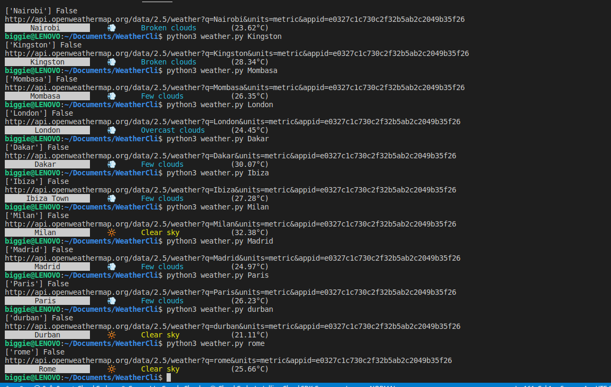

# WeatherAppCli
This is an app running in the command line using the open weather API to give weather status for different cities in the world through the command line

Generate your Api key in:https://home.openweathermap.org/api_keys




# How To Run The APP:
```
1.git clone https://github.com/Marsh-sudo/WeatherAppCli.git

2.cd WeatherCli

3.Create  a file called secrets.ini and add the following:

    [openweather]
    api_key= 123233eab45625b

4.Run:python3 weather.py "Name of the city"
```
